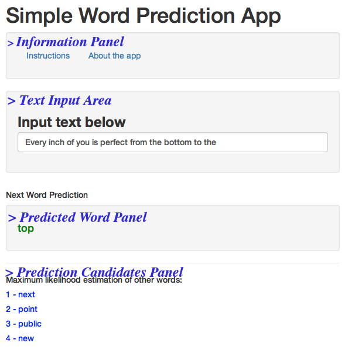

# Overview

The `Simple Word Prediction App` is based on a corpora from several blogs, news sites and twitter feeds.
It uses `Natural Language Processing` or `NLP` techniques to return the next word with the highest likelihood based on the previous 1,2 ... n words entered.

The app will also return several more words as prediction candidates.

> **ENJOY**

---

# The Algorithm

The application is based on N-grams (1 to 3) and a back-off algorithm for when rare combinations of words is encountered.
 - A curated combined corpora of all 3 datasets (news, blogs, twitter) is being used
 - N-gram frequencies are calculated for the new dataset
 - Top 1+4 highest frequencies closest to the unigram, bigram or trigram are returned

---

# The App

The GUI of the app is very simple and is divided in 4 areas as below

---

# The App

 - Use the tabs on top for instructions
 - It will take a couple of seconds for the app to load.
 - Once it loads, it will show automatically one of the quiz entries in Coursera and it's most likely prediction.
 - Type something and wait for the answer and 4 more suggestions
 - The milestone report will explain how the N-grams were formed [link](http://rgeos.github.io/capstone/)
 
> Enjoy the app at [link](https://rgeos.shinyapps.io/Capstone)